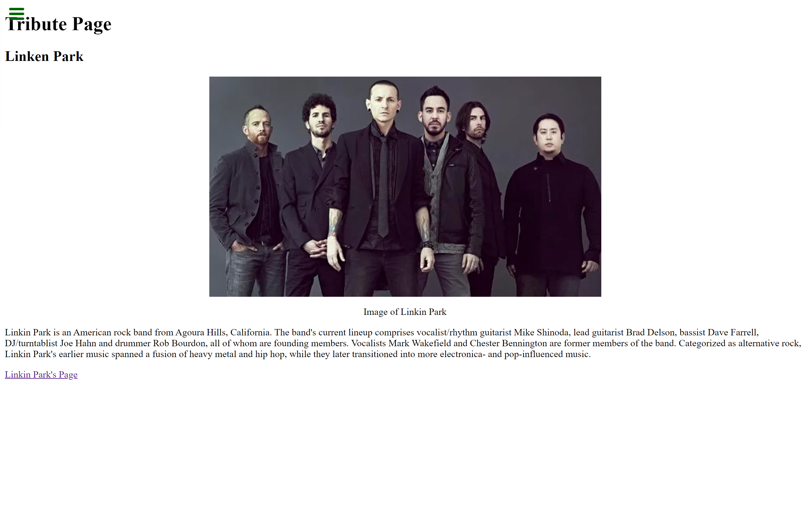

# freeCCTributePage

## Description

This page is one of the practice challenges on FreeCodeCamp.org to make My tribute page that includes a basic setup of html with a little bit of css.  The tribue I picked was linkin park.

## Acceptance Criteria

User Story #1: My tribute page should have an element with a corresponding id="main", which contains all other elements.

User Story #2: I should see an element with a corresponding id="title", which contains a string (i.e. text) that describes the subject of the tribute page (e.g. "Dr. Norman Borlaug").

User Story #3: I should see a div element with a corresponding id="img-div".

User Story #4: Within the img-div element, I should see an img element with a corresponding id="image".

User Story #5: Within the img-div element, I should see an element with a corresponding id="img-caption" that contains textual content describing the image shown in img-div.

User Story #6: I should see an element with a corresponding id="tribute-info", which contains textual content describing the subject of the tribute page.

User Story #7: I should see an a element with a corresponding id="tribute-link", which links to an outside site that contains additional information about the subject of the tribute page. HINT: You must give your element an attribute of target and set it to _blank in order for your link to open in a new tab (i.e. target="_blank").

User Story #8: The img element should responsively resize, relative to the width of its parent element, without exceeding its original size.

User Story #9: The img element should be centered within its parent element.

## Table of Contents

- [Installation](#installation)
- [Screenshot](#screenshot)
- [Website](#website)
- [Credits](#credits)
- [License](#license)

## Installation
Once pulled over from gitHub onto your local machine.
- First is to open up Microsoft Visual Studio Code.

- Then over on the side bar click ad folder to workspace

- Once you see on the files, to view in browser, right click index.html under workspace and then click Reveal in file explorer.

- Once the window comes up with the file. Just double click the file and the file will open up in the browser of your choice. 

## Screenshot

Here is a screenshot of the actual webpage.
 
 
 

## Credits

https://www.freecodecamp.org/learn/responsive-web-design/responsive-web-design-projects/build-a-tribute-page

## Website
https://coreynance.github.io/freeCCTributePage/

## License
MIT License

Copyright (c) [2021] [Corey Nance]

Permission is hereby granted, free of charge, to any person obtaining a copy
of this software and associated documentation files (the "Software"), to deal
in the Software without restriction, including without limitation the rights
to use, copy, modify, merge, publish, distribute, sublicense, and/or sell
copies of the Software, and to permit persons to whom the Software is
furnished to do so, subject to the following conditions:

The above copyright notice and this permission notice shall be included in all
copies or substantial portions of the Software.

THE SOFTWARE IS PROVIDED "AS IS", WITHOUT WARRANTY OF ANY KIND, EXPRESS OR
IMPLIED, INCLUDING BUT NOT LIMITED TO THE WARRANTIES OF MERCHANTABILITY,
FITNESS FOR A PARTICULAR PURPOSE AND NONINFRINGEMENT. IN NO EVENT SHALL THE
AUTHORS OR COPYRIGHT HOLDERS BE LIABLE FOR ANY CLAIM, DAMAGES OR OTHER
LIABILITY, WHETHER IN AN ACTION OF CONTRACT, TORT OR OTHERWISE, ARISING FROM,
OUT OF OR IN CONNECTION WITH THE SOFTWARE OR THE USE OR OTHER DEALINGS IN THE
SOFTWARE.
